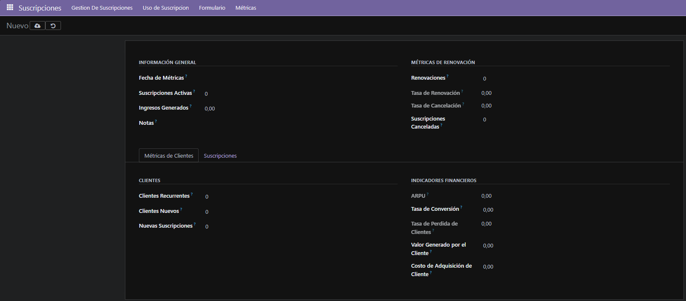
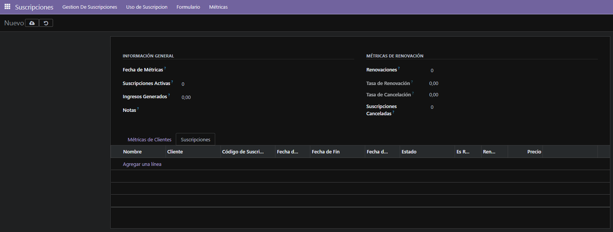

# **Sistema de Gestión de Tareas Pendientes**
### **Descripción del proyecto**
Como tenemos muy poco tiempo para desarrollar este proyecto, vamos a reutilizar las prácticas que hemos hecho con un módulo para la gestión de suscripciones. El objetivo será extender ese módulo con otro modelo de Métricas y estadísticas.

### **Campos del modelo**
- **Fecha**
- **Número de suscripciones activas**
- **Ingresos generados**
- **Ingresos generados**
- **Tasa de renovación**
- **Tasa de cancelación**
- **Renovaciones**
- **Nuevas suscripciones**
- **Suscripciones canceladas**
- **Clientes recurrentes vs nuevos**
- **Ingresos promedio por usuario (ARPU)**
- **Tasa de conversión**
- **Churn Rate (Tasa de Pérdida de Clientes)**
- **Lifetime Value (LTV)**
- **Costo de adquisición de clientes (CAC)**
- **Notas**
- **Relación con el Modelo de Suscripciones**

### Me base en el módulo de [Suscripciones](../ut07/pr0702/doc.md)

## 1. Creacion de modelo llamado `metricas_estadisticas`
Cree el nuevo fichero, lo añadi a `ir.models.access.py` y a `_init_.py`

```python
# -*- coding: utf-8 -*-

from odoo import models, fields, api #type:ignore


class metricas_estadisticas(models.Model):
    _name = 'subscription.metricas_estadisticas'
    _description = 'subscription.metricas_estadisticas'

    fecha = fields.Date(required=True, string="Fecha de Métricas")
    suscripciones_activas = fields.Integer(string="Suscripciones Activas")
    ingresos_generados = fields.Float(string="Ingresos Generados")
    tasa_renovacion = fields.Float(compute='_compute_tasa_renovacion', store=True, string="Tasa de Renovación")
    tasa_cancelacion = fields.Float(compute='_compute_tasa_cancelacion', store=True, string="Tasa de Cancelación")
    renovaciones = fields.Integer(string="Renovaciones")
    nuevas_suscripciones = fields.Integer(string="Nuevas Suscripciones")
    suscripciones_canceladas = fields.Integer(string="Suscripciones Canceladas")
    clientes_recurrentes = fields.Integer(string="Clientes Recurrentes")
    clientes_nuevos = fields.Integer(string="Clientes Nuevos")
    arpu = fields.Float(compute='_compute_arpu', store=True, string="ARPU")
    tasa_conversion = fields.Float(string="Tasa de Conversión")
    churn_rate = fields.Float(compute='_compute_churn_rate', store=True, string="Tasa de Perdida de Clientes")
    ltv = fields.Float(string="Valor Generado por el Cliente")
    cac = fields.Float(string="Costo de Adquisición de Cliente")
    notas = fields.Text(string="Notas")
    subscription_ids = fields.One2many(comodel_name='subscription.subscription', inverse_name='metrica_id', string="Suscripciones")

    @api.depends('renovaciones', 'suscripciones_activas')
    def _compute_tasa_renovacion(self):
        for record in self:
            if record.suscripciones_activas:
                record.tasa_renovacion = (float(record.renovaciones) * 100) / float(record.suscripciones_activas)
            else:
                record.tasa_renovacion = 0.0

    @api.depends('suscripciones_canceladas', 'suscripciones_activas')
    def _compute_tasa_cancelacion(self):
        for record in self:
            if record.suscripciones_activas:
                record.tasa_cancelacion = (float(record.suscripciones_canceladas) * 100) / float(record.suscripciones_activas)
            else:
                record.tasa_cancelacion = 0.0

    @api.depends('ingresos_generados', 'suscripciones_activas')
    def _compute_arpu(self):
        for record in self:
            if record.suscripciones_activas:
                record.arpu = record.ingresos_generados / float(record.suscripciones_activas)
            else:
                record.arpu = 0.0

    @api.depends('suscripciones_canceladas', 'suscripciones_activas')
    def _compute_churn_rate(self):
        for record in self:
            if record.suscripciones_activas:
                record.churn_rate = (float(record.suscripciones_canceladas) * 100) / float(record.suscripciones_activas)
            else:
                record.churn_rate = 0.0
```

## 2. Modifique el de modelo llamado `views`
Añadi la vista formulario con id `metricas_estadisticas_form`

```xml
<odoo>
  <data>
    <!-- explicit list view definition -->

    <record model="ir.ui.view" id="subscription_basic">
      <field name="name">Gestion De Suscripciones</field>
      <field name="model">subscription.subscription</field>
      <field name="arch" type="xml">
        <tree limit="15" decoration-danger="status=='expired'" decoration-warning="status=='cancelled'">
          <field name="name"/>
          <field name="customer_id"/>
          <field name="subscription_code"/>
          <field name="start_date"/>
          <field name="end_date" widget="remaining_days"/>
          <field name="renewal_date"/>
          <field name="status" widget="radio"/>
          <field name="is_renewable"/>
          <field name="auto_renewal"/>
          <field name="price" attrs="{'invisible': [('status', '==', 'cancelled')]}"/>
          <button name="add_days"
          type="object"
          string="Añadir 15 dias"
          class="btn-primary"
          icon="fa-plus"/>
        </tree>
      </field>
    </record>

    <record model="ir.ui.view" id="subscription_usage">
      <field name="name">Uso de Suscripcion</field>
      <field name="model">subscription.subscription</field>
      <field name="arch" type="xml">
        <tree decoration-danger="use_percent>=80" limit="15">
          <field name="usage_limit"/>
          <field name="current_usage" avg="1"/>
          <field name="use_percent" widget="percentpie"/>
        </tree>
      </field>
    </record>

    <record model="ir.ui.view" id="subscription_form">
      <field name="name">Formulario</field>
      <field name="model">subscription.subscription</field>
      <field name="arch" type="xml">
        <form>
          <sheet>
            <group name="informacion_basica" string="Información Básica">
              <field name="name"/>
              <field name="customer_id"/>
              <field name="subscription_code"/>
            </group>

            <separator/>

            <notebook>
              <page string="Informacion Basica">
                <group col="4">
                  <field name="name"/>
                  <field name="customer_id"/>
                  <field name="subscription_code"/>
                  <field name="start_date"/>
                  <field name="end_date"/>
                  <field name="renewal_date"/>
                  <field name="status"/>
                  <field name="is_renewable"/>
                  <field name="auto_renewal"/>
                  <field name="price"/>
                </group>
              </page>
              <page string="Infromacion de Uso">
              <group>
                <field name="usage_limit"/>
                <field name="current_usage"/>
                <field name="use_percent"/>
              </group>
              </page>
            </notebook>
          </sheet>
        </form>
      </field>
    </record>

    <record model="ir.ui.view" id="metricas_estadisticas_form">
      <field name="name">Métricas Estadísticas</field>
      <field name="model">subscription.metricas_estadisticas</field>
      <field name="arch" type="xml">
        <form>
          <sheet>
            <group>
              <group string="Información General">
                <field name="fecha"/>
                <field name="suscripciones_activas"/>
                <field name="ingresos_generados"/>
                <field name="notas"/>
              </group>
              <group string="Métricas de Renovación">
                <field name="renovaciones"/>
                <field name="tasa_renovacion"/>
                <field name="tasa_cancelacion"/>
                <field name="suscripciones_canceladas"/>
              </group>
            </group>
            
            <notebook>
              <page string="Métricas de Clientes">
                <group>
                  <group string="Clientes">
                    <field name="clientes_recurrentes"/>
                    <field name="clientes_nuevos"/>
                    <field name="nuevas_suscripciones"/>
                  </group>
                  <group string="Indicadores Financieros">
                    <field name="arpu"/>
                    <field name="tasa_conversion"/>
                    <field name="churn_rate"/>
                    <field name="ltv"/>
                    <field name="cac"/>
                  </group>
                </group>
              </page>
              <page string="Suscripciones">
                <field name="subscription_ids"/>
              </page>
            </notebook>
          </sheet>
        </form>
      </field>
    </record>

    <!-- actions opening views on models -->

    <record model="ir.actions.act_window" id="subscription_basic_action_gestion">
      <field name="name">Gestion_De Suscripciones</field>
      <field name="res_model">subscription.subscription</field>
      <field name="view_mode">tree,form</field>
      <field name="view_id" ref="subscription_basic"/>
    </record>

    <record model="ir.actions.act_window" id="subscription_usage_action_use">
      <field name="name">Uso de Suscripcion</field>
      <field name="res_model">subscription.subscription</field>
      <field name="view_mode">tree,form</field>
      <field name="view_id" ref="subscription_usage"/>
    </record>

    <record model="ir.actions.act_window" id="subscription_action_form">
      <field name="name">Formulario</field>
      <field name="res_model">subscription.subscription</field>
      <field name="view_mode">form</field>
      <field name="view_id" ref="subscription_form"/>
    </record>

    <record model="ir.actions.act_window" id="action_metricas_estadisticas">
      <field name="name">Métricas Estadísticas</field>
      <field name="res_model">subscription.metricas_estadisticas</field>
      <field name="view_mode">form,tree</field>
    </record>

    <!-- Top menu item -->

    <menuitem name="Suscripciones" id="subscription.menu_root"/>

    <!-- menu categories -->

    <menuitem name="Gestion De Suscripciones" id="subscription.menu_1" parent="subscription.menu_root"/>
    <menuitem name="Uso de Suscripcion" id="subscription.menu_2" parent="subscription.menu_root"/>
    <menuitem name="Formulario" id="subscription.menu_3" parent="subscription.menu_root"/>
    <menuitem name="Métricas" id="subscription.menu_4" parent="subscription.menu_root"/>

    <!-- actions -->

    <menuitem name="Gestion De Suscripciones" id="subscription.menu_1_list" parent="subscription.menu_1"
              action="subscription_basic_action_gestion"/>
    <menuitem name="Uso de Suscripcion" id="subscription.menu_2_list" parent="subscription.menu_2"
              action="subscription_usage_action_use"/>
    <menuitem name="Formulario" id="subscription.menu_3_form" parent="subscription.menu_3"
              action="subscription_action_form"/>
    <menuitem name="Métricas Estadísticas" id="subscription.menu_4_metrics" parent="subscription.menu_4"
              action="action_metricas_estadisticas"/>

  </data>
</odoo>
```

## 3. Resultados



## 4. Descarga
[Descargar Módulo](subscription.zip)