# **Manual de Inventario con API en Odoo**

Este manual describe cómo instalar el módulo de Inventario en Odoo, gestionar productos y configurar una API de búsqueda de imágenes de Google para vincular imágenes de productos en el sistema.

---

## **1. Instalación del Módulo de Inventario**

Para comenzar a gestionar el inventario en Odoo, es necesario activar el módulo de Inventario.

1. Dirígete al menú principal y selecciona **Aplicaciones**.
2. En la barra de búsqueda, escribe **Inventario** y selecciona el módulo.
3. Haz clic en el botón **Instalar**.

   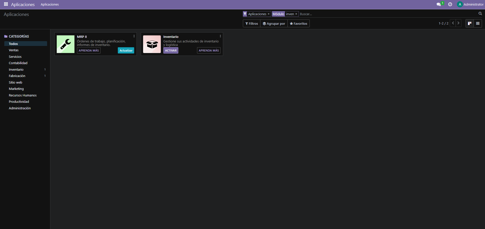

---

## **2. Creación de Productos**

Una vez que el módulo de Inventario esté activo, sigue los pasos para importar productos al sistema.

1. Accede al menú de **Productos** desde el módulo de Inventario.
2. Haz clic en el botón de **Favoritos** (el icono de estrella en la parte superior derecha) y selecciona **Importar registros**.

   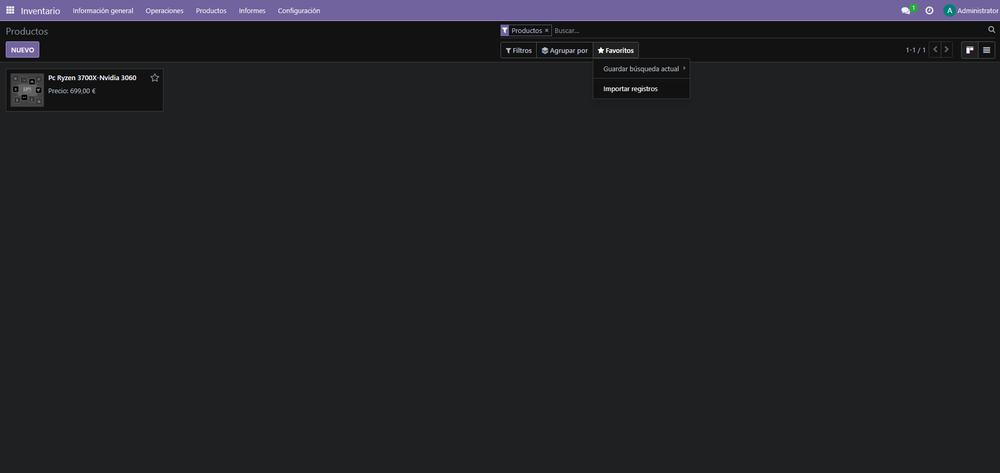

3. Carga el archivo CSV con los datos de los productos. Asegúrate de que el archivo CSV contenga las columnas correctas con los datos de los productos, como nombre, código de producto, y categoría.

   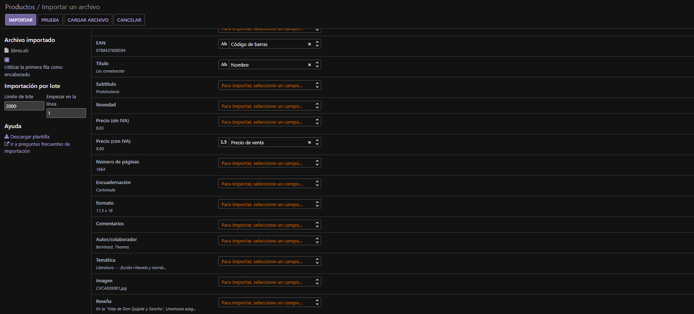

---

## **3. Creación de APIs**

Para realizar búsquedas automáticas de imágenes en Google, es necesario configurar una API en Google Cloud.

### Paso 1: Crear Proyecto en Google Cloud
1. Ve a [Google Cloud Console](https://console.cloud.google.com/apis/dashboard) y accede con tu cuenta de Google.
2. En el menú superior, selecciona **Credenciales** y crea una **Clave API**.

   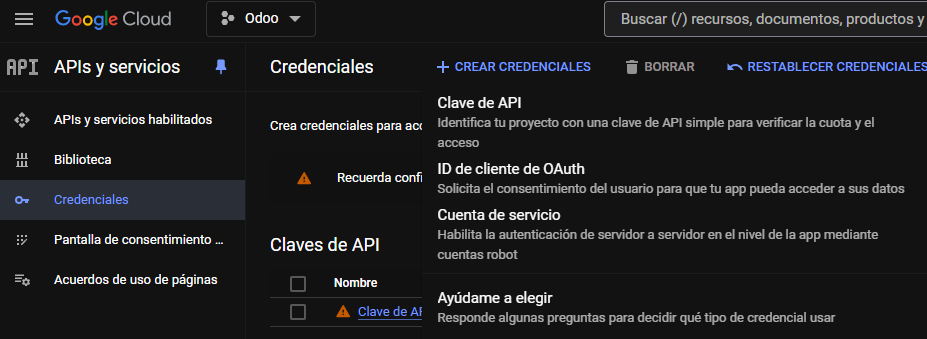

### Paso 2: Activar la API de Búsqueda Personalizada
1. Desde la consola de Google Cloud, activa la **API Custom Search**. Esto permite realizar búsquedas de imágenes en Google a través de la API.

   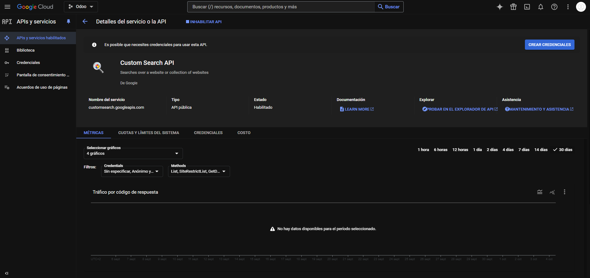

### Paso 3: Crear Motor de Búsqueda Personalizado
1. Accede a [Google Programmable Search Engine](https://programmablesearchengine.google.com) para crear un motor de búsqueda personalizado.
2. Configura el motor con el nombre que desees y asegúrate de habilitar la opción de búsqueda de imágenes. Al finalizar, se te proporcionará una **Clave API**.

   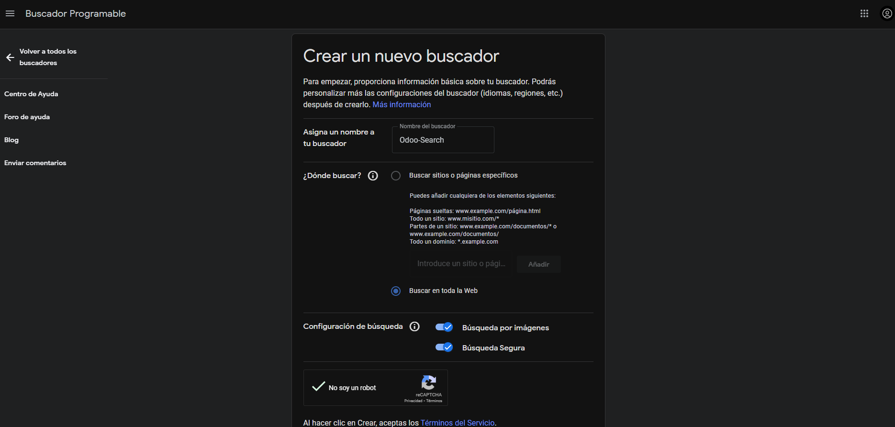

---

## **4. Implementación de Búsqueda por Imágenes en Odoo**

Una vez configuradas las APIs de Google, sigue estos pasos para integrar la búsqueda de imágenes en Odoo.

### Paso 1: Configuración en Odoo
1. En Odoo, ve a **Configuración** > **General**.
2. Busca la opción **Google Images** e introduce las dos claves API que obtuviste anteriormente:
   - La **API Key** de Google Cloud.
   - El **ID del motor de búsqueda personalizado** (Programmable Search Engine).

   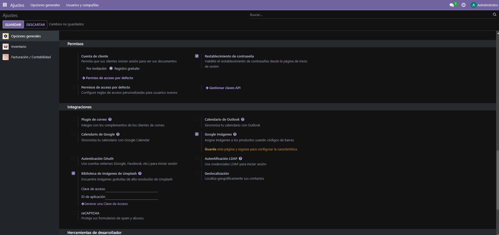

### Paso 2: Obtener Imágenes para los Productos
1. Vuelve al módulo de **Inventario** y accede a la lista de **Productos**.

   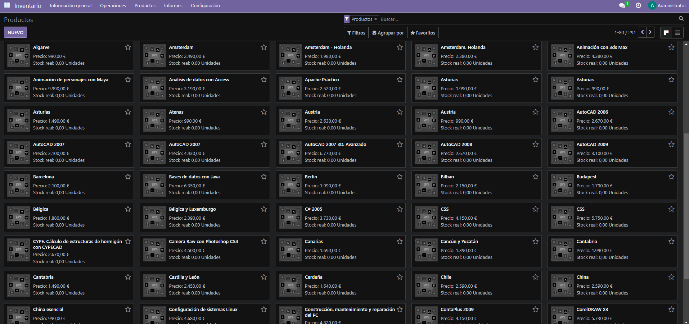

2. Selecciona un producto de la lista.
3. Haz clic en **Acción** y selecciona **Obtener imágenes de Google Imágenes**.
4. Odoo realizará una búsqueda automática en Google Imágenes usando los datos del producto. Selecciona la imagen que desees asignar al producto.

   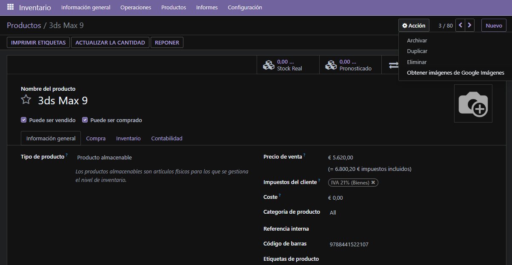 
   

    
   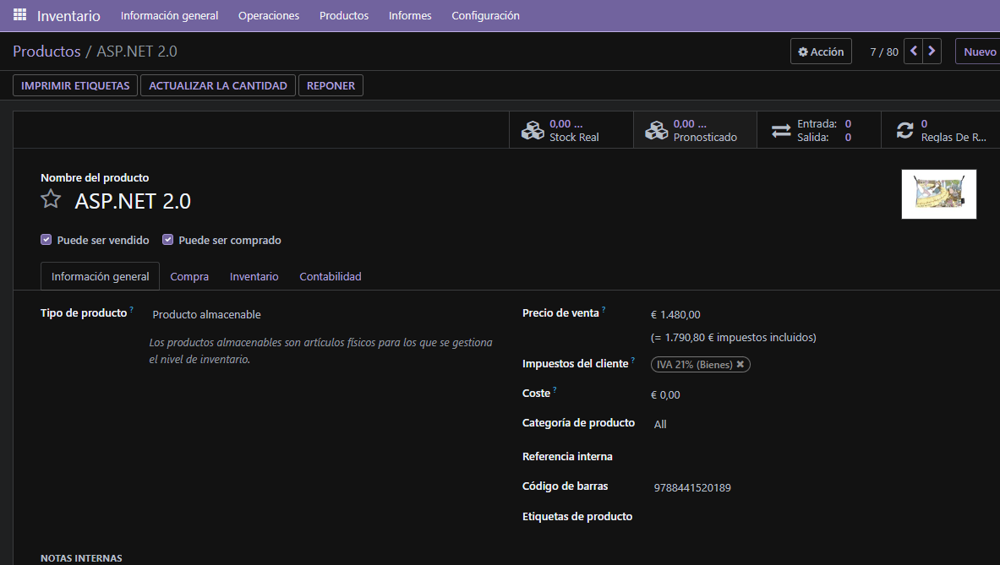

---

## **5. Resultado Final: Visualización de Productos**

Una vez que hayas importado los productos y asignado imágenes, el catálogo de productos debería verse similar al siguiente ejemplo:

   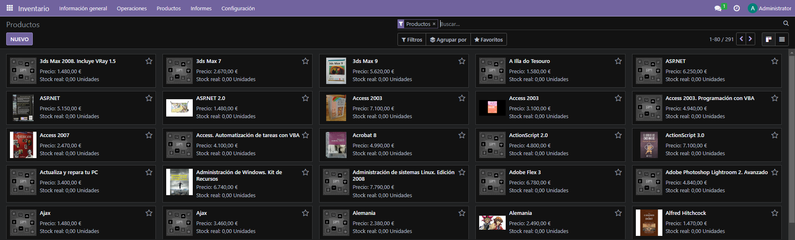