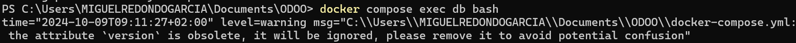
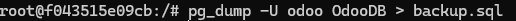
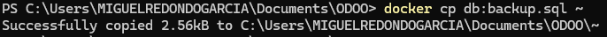
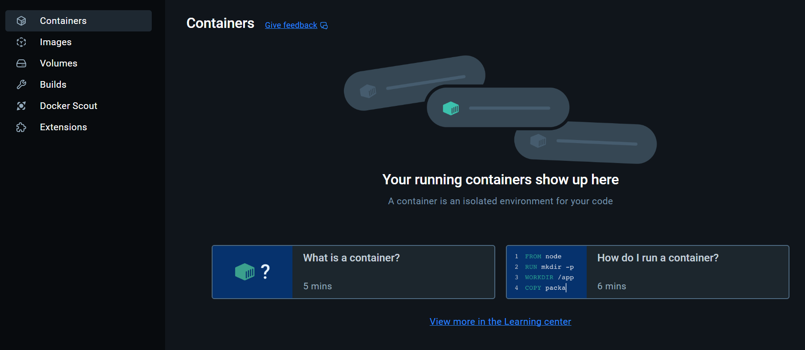
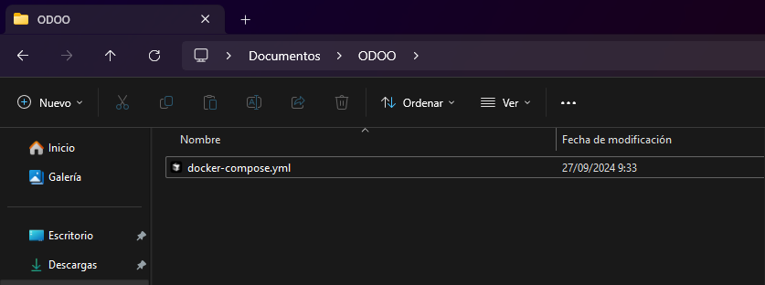
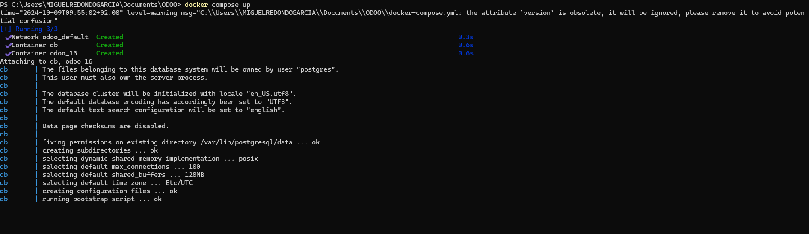
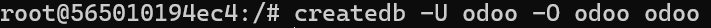
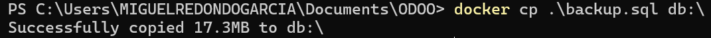
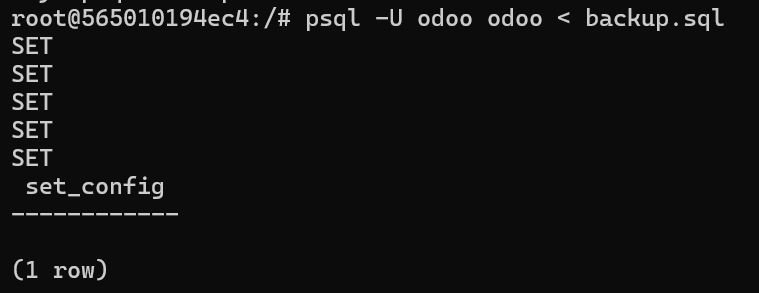

# **Manual de Copia de Seguridad Por Comandos**

Este manual describe cómo hacer copias de seguridad en una base de datos postgres en Odoo por comandos

---

## **1. Creación de copia de seguridad**

Lo primero es abrir la terminal en la carpeta donde se tenga odoo en mi caso es "ODOO"

1. Ahi ejecuto el siguiente comando para iniciar una terminal dentro del contenedor de "db"
```bash
docker compose exec db bash
```


   

2. Ejecuto el comando siguiente comando donde "odoo" es el usuario administador, "OdooDB" el nombre de la base de datos y "backup.sql" la ruta donde esta tu copia de seguridad **(El nombre de la base de datos se obtiene en [Manager DB](http://localhost:8069/web/database/manager))**

```bash
pg_dump -U odoo OdooDB > backup.sql
```

   

3. Luego muevo mi archivo desde el docker a mi ordenador con el comando 

```bash
docker cp db:backup.sql ~
```

   
   
---

## **2. Eliminación de base de datos**

1. Elimine los contenedores

   

1. Y después los directorios que tenia en mi carpeta ODOO

   

---

## **3. Creación de ODOO y la base de datos**

1. Cree los docker otra vez con el .yml y el siguiente comando y como ya esta configurado en el .yml se creo "dataPG", "VolumenesODOO" y dentro de ella "sessions", "filestore" y "addons"

```bash
docker compose up
```

   

---

## **4. Restauración de la copia de seguridad**

1. Creamos una base de datos con el siguiente comando (donde "odoo" es el nombre de usuario y los otros 2 "odoo" son el nombre de la base de datos y el usuario propietario)

```bash
createdb -U odoo -O odoo odoo
```

   

2. Después copio desde mi ruta adentro del docker con el comando

```bash
docker cp .\backup.sql db:\
```

   


4. Abro la bash dentro del docker y ahi ejecuto donde "odoo" es el usuario administador, "odoo" el nombre de la base de datos y "backup.sql" la ruta donde esta tu copia de seguridad

```bash
psql -U odoo odoo < backup.sql
```



## **5. Resultado**

No pude tener el resultado esperado por el cambio de firesotre a filestore, asi que después de varias pruebas conseguí que se ejecutase el login, pero no se mostraba nada

   