# Manual de Facturación en Odoo

## 1. Instalación del Módulo de Facturación

Para comenzar a utilizar el módulo de facturación en Odoo, es necesario activarlo desde el apartado de aplicaciones.

1. Dirígete al menú superior y selecciona **Aplicaciones**.
2. Busca el módulo de **Facturación** y haz clic en **Instalar**.

   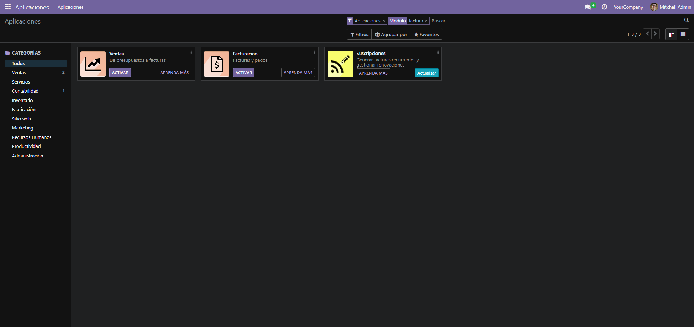

## 2. Creación de un Usuario Secundario

Para crear un usuario que se encargue de la facturación, sigue los pasos a continuación:

1. En la esquina superior derecha, accede al menú de **Ajustes**.
2. Dentro de los ajustes, selecciona **Gestión de Usuarios**.

   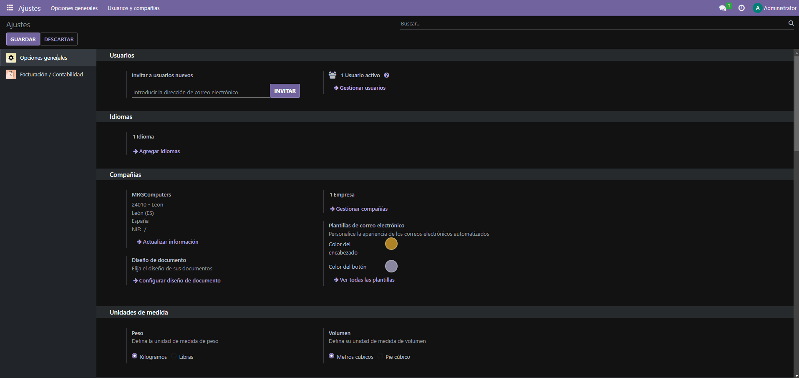

3. Haz clic en **Crear** para añadir un nuevo usuario. Completa la información correspondiente y asigna los permisos específicos de acceso a facturación.

   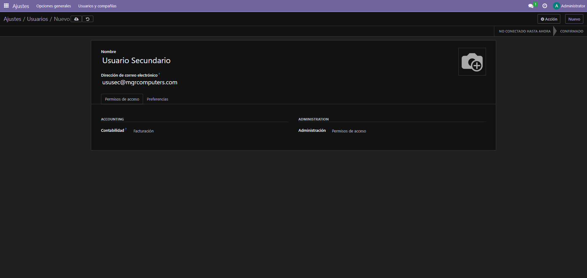

4. Luego de crear el usuario, vuelve a la pantalla principal y acepta la invitación que llegará al correo del nuevo usuario.
5. Haz clic en el enlace proporcionado en el correo para confirmar la cuenta.

   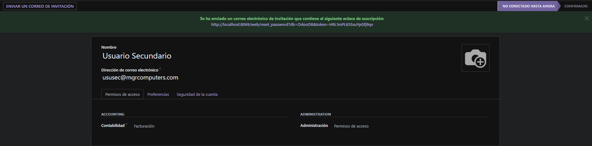

6. El enlace te llevará a una página donde deberás confirmar el nombre, correo electrónico y establecer una contraseña para el nuevo usuario.

   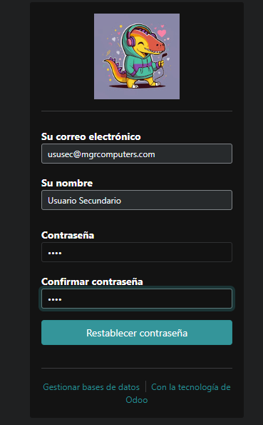

## 3. Configuración de Facturas

Una vez creado el usuario, es momento de configurar las facturas para personalizarlas según las necesidades de la empresa.

1. Accede al módulo de **Facturación** desde el menú superior.

   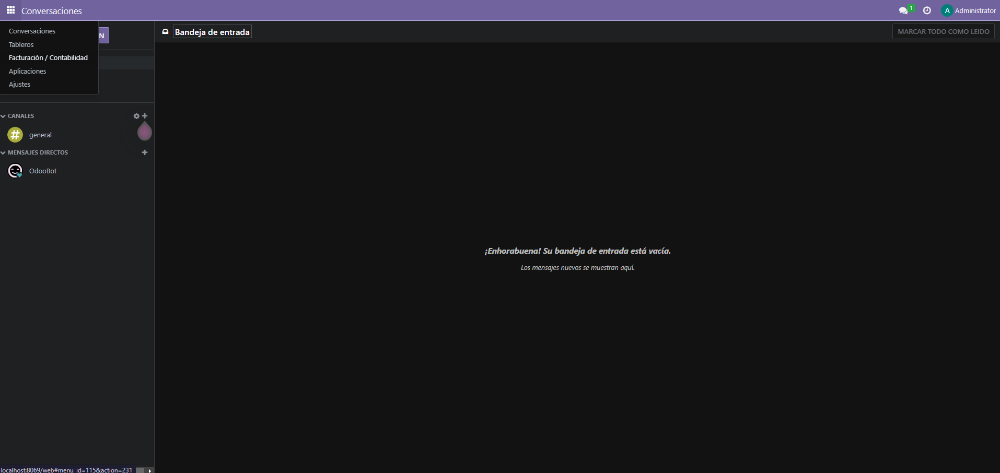

2. En el menú de **Diseño de Factura**, selecciona la opción de personalizar la factura.

   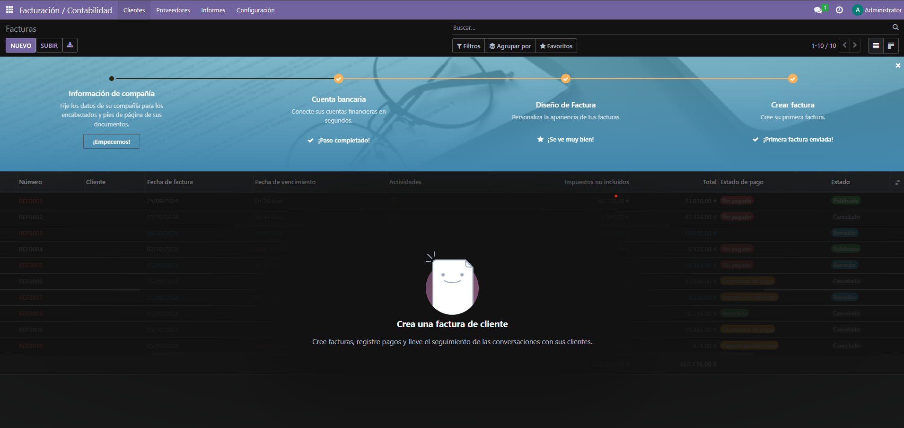

3. Personaliza la factura según los requisitos de tu empresa. Puedes modificar el formato, el logo, entre otros detalles.

   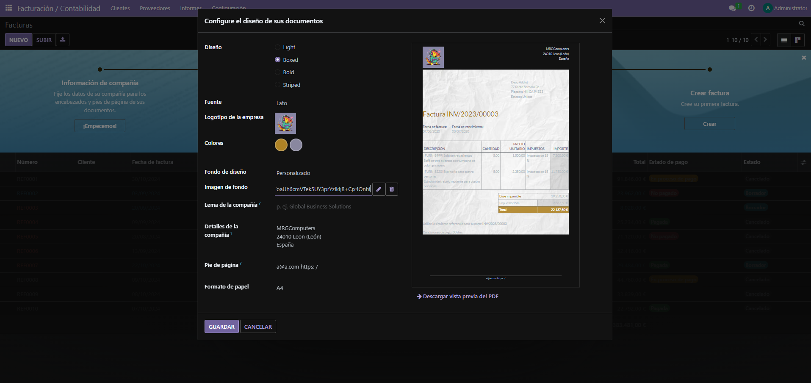

4. Para añadir un código QR a las facturas, dirígete a los ajustes de facturación y activa la opción correspondiente.

   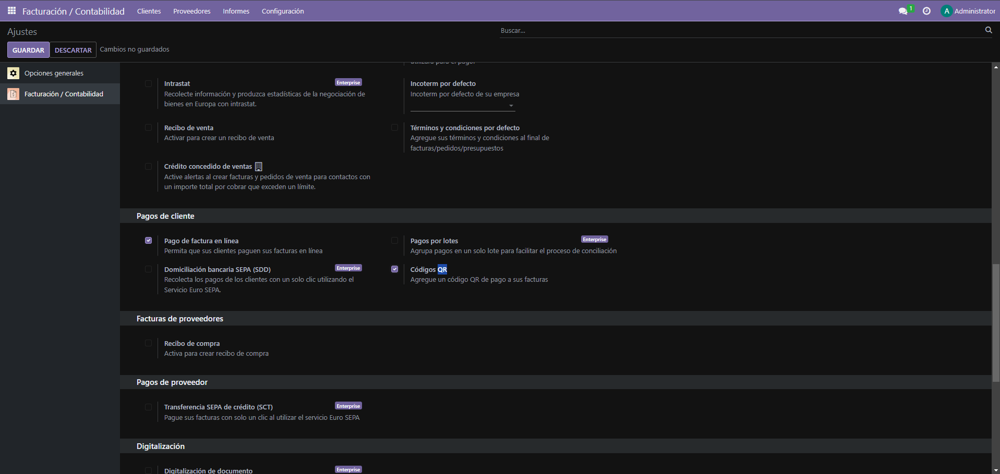

## 4. Importación de Clientes

Para cargar una lista de clientes en el sistema, sigue los siguientes pasos:

1. En el módulo de **Facturación**, selecciona la sección de **Clientes**.

   

2. Haz clic en **Favoritos** y selecciona la opción de **Importar archivo CSV**.

   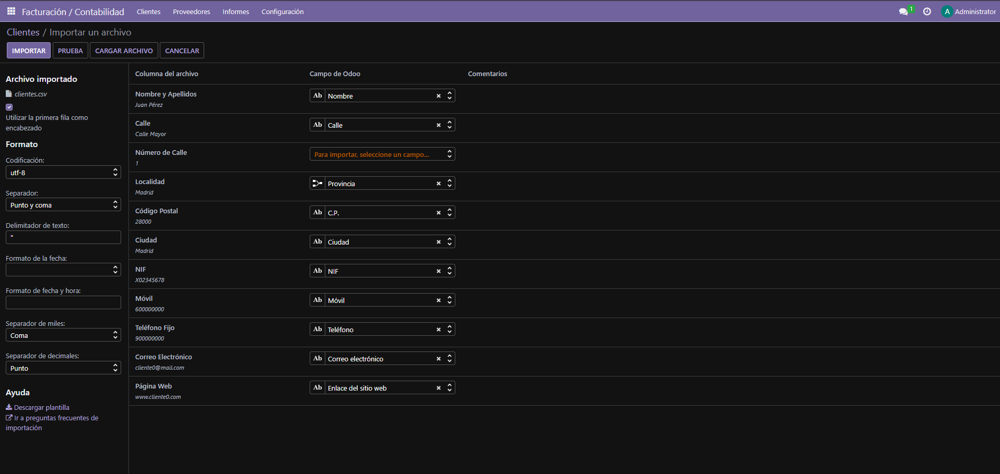

3. Configura los campos del archivo CSV para que coincidan con los campos de la base de datos de Odoo. Excluye cualquier campo que no sea necesario, como el "Número de Calle".

4. Tras realizar la importación, los clientes aparecerán en la lista de **Clientes**.

   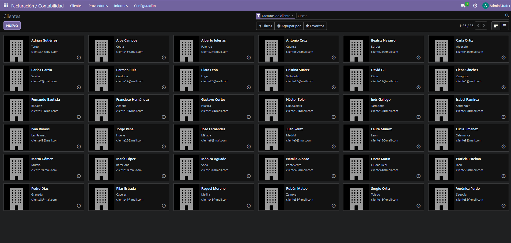

## 5. Creación de Productos

Para añadir productos al sistema, sigue los siguientes pasos:

1. En el módulo de **Proveedores y Productos**, haz clic en **Crear**.

   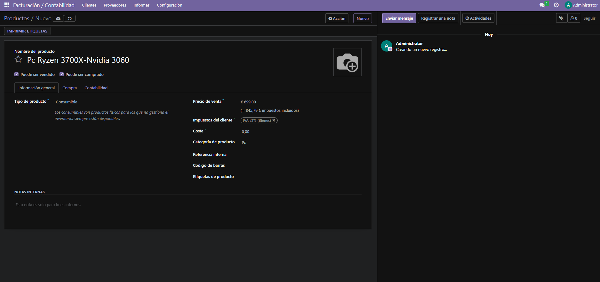

2. Completa la información requerida del producto, como nombre, descripción, precio, y cualquier otro detalle necesario.

## 6. Creación de una Factura con el Usuario Secundario

1. Cierra sesión con el usuario administrador e inicia sesión con el usuario secundario creado anteriormente.
2. Accede al módulo de **Facturación**.
3. Selecciona la opción de **Crear Factura** y elige el producto creado previamente para generar la factura.

   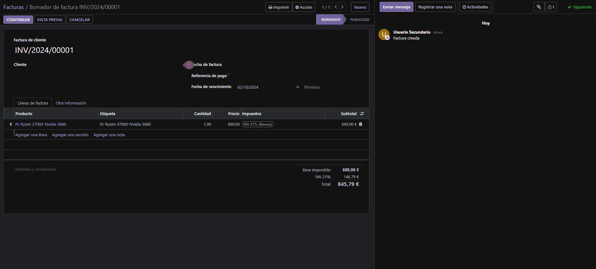

## 7. Resultado Final de la Factura

A continuación se muestra el ejemplo de una factura generada utilizando los pasos anteriores:

   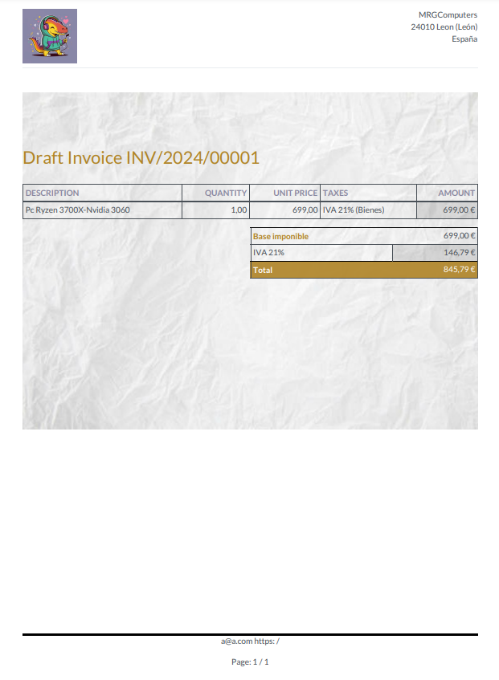

[Descargar Factura en PDF](img/factura.pdf)