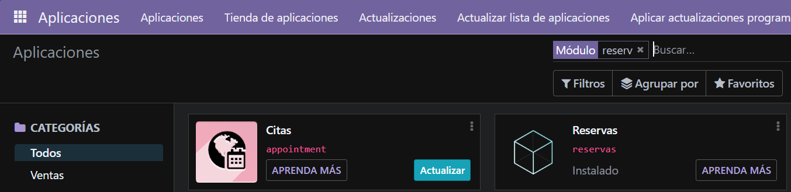
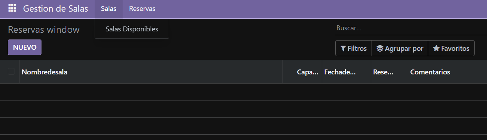
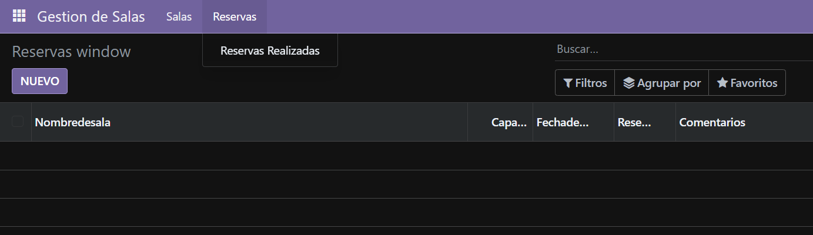

# Creación del primer modulo

## 1. Cracion de estuctura de modulo

Se abre un bash dentro del docker odoo y se ejecuta:
```bash
odoo scaffold Reservas /mnt/extra-addons
```

## 2. Modificacion de manifest
Se abre el `manifest.py` y se modifica el fichero para que quede asi:

```python
# -*- coding: utf-8 -*-
{
    'name': "Reservas",

    'summary': """
        Gestiona reservas en una empresa""",

    'description': """
        Este módulo permite gestionar reservas de manera eficiente, facilitando la administración de recursos y la planificación de actividades.
    """,

    'author': "Miguel Redondo",
    'website': "https://www.yourcompany.com",

    # Categories can be used to filter modules in modules listing
    # Check https://github.com/odoo/odoo/blob/16.0/odoo/addons/base/data/ir_module_category_data.xml
    # for the full list
    'category': 'Management',
    'version': '1.0',

    # any module necessary for this one to work correctly
    'depends': ['base'],

    # always loaded
    'data': [
        'security/ir.model.access.csv',
        'views/views.xml',
        'views/templates.xml',
    ],
    # only loaded in demonstration mode
    'demo': [
        'demo/demo.xml',
    ],
}
```
## 3. Definicion de modelo
Se abre el archivo `models.py` y se define el modelo `Reservas` de la siguiente manera:

```python
# -*- coding: utf-8 -*-

from odoo import models, fields


class reservas(models.Model):
    _name = 'reservas.reservas'
    _description = 'reservas.reservas'

    nombreDeSala = fields.Char()
    capacidad = fields.Integer()
    fechaDeReserva = fields.Date()
    reservada = fields.Boolean()
    comentarios = fields.Char()
```


## 4. Definición de vistas y acciones
Aquí se define los menus y las vistas que hay estan en el modulo

```xml
<odoo>
  <data>
    <!-- explicit list view definition -->

    <record model="ir.ui.view" id="reservas.list">
      <field name="name">Reservas list</field>
      <field name="model">reservas.reservas</field>
      <field name="arch" type="xml">
        <tree>
          <field name="nombreDeSala"/>
          <field name="capacidad"/>
          <field name="fechaDeReserva"/>
          <field name="reservada"/>
          <field name="comentarios"/>
        </tree>
      </field>
    </record>


    <!-- actions opening views on models -->

    <record model="ir.actions.act_window" id="reservas.action_window">
      <field name="name">Reservas window</field>
      <field name="res_model">reservas.reservas</field>
      <field name="view_mode">tree,form</field>
    </record>


    <!-- server action to the one above -->
<!--
    <record model="ir.actions.server" id="reservas.action_server">
      <field name="name">Reservas server</field>
      <field name="model_id" ref="model_reservas_reservas"/>
      <field name="state">code</field>
      <field name="code">
        action = {
          "type": "ir.actions.act_window",
          "view_mode": "tree,form",
          "res_model": model._name,
        }
      </field>
    </record>
-->

    <!-- Top menu item -->

    <menuitem name="Gestion de Salas" id="reservas.menu_root"/>

    <!-- menu categories -->
    <menuitem name="Salas" id="reservas.salas" parent="reservas.menu_root"/>
    <menuitem name="Reservas" id="reservas.myreservas" parent="reservas.menu_root"/>

    <!-- actions -->

    <menuitem name="Salas Disponibles" id="reservas.salas_disp" parent="reservas.salas"
              action="reservas.action_window"/>
    <menuitem name="Reservas Realizadas" id="reservas_reali" parent="reservas.myreservas"
              action="reservas.action_window"/>

  </data>
</odoo>
```
## 7. Instalación de modulos
Vamos a `aplicaciones` e instalamos nuestro modulo



## 6. Resultados


