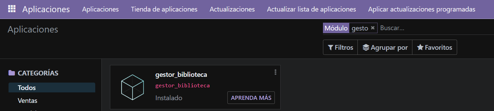
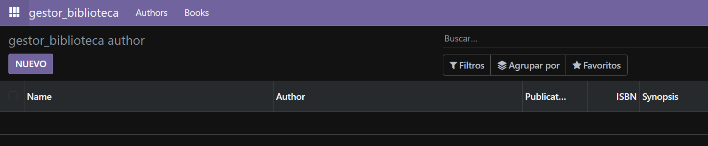

# Creación del modulo con varios modelos


## 1. Cracion de estuctura de modulo

Se abre un bash dentro del docker odoo y se ejecuta:
```bash
odoo scaffold gestor_biblioteca /mnt/extra-addons
```


## 2. Creacion de modelo `author`

```python
# -*- coding: utf-8 -*-

from odoo import models, fields, api #type: ignore


class gestor_biblioteca_author(models.Model):
    _name = 'gestor_biblioteca.gestor_biblioteca_author'
    _description = 'gestor_biblioteca.gestor_biblioteca_author'

    name = fields.Char(string='Name', required=True)
    author = fields.Char(string='Author')
    publication_date = fields.Date(string='Publication Date')
    isbn = fields.Integer(string='ISBN')
    synopsis = fields.Text(string='Synopsis')
```


## 3. Creacion de modelo `book`

```python
# -*- coding: utf-8 -*-

from odoo import models, fields, api #type: ignore


class gestor_biblioteca_book(models.Model):
    _name = 'gestor_biblioteca.gestor_biblioteca_book'
    _description = 'gestor_biblioteca.gestor_biblioteca_book'

    name = fields.Char(string='Name', required=True)
    birthday = fields.Date(string='Birth Date')
    biography = fields.Text(string='Biography')
    book = fields.Text(string='Book')
```


## 4. Modificacion de `__init__` de modelos

Se importan los 2 modelos creados anteriormente

```python
# -*- coding: utf-8 -*-

from . import gestor_biblioteca_author
from . import gestor_biblioteca_book
```


## 5. Creacion de View de `Author`

Se colocan los campos creados en el modelo y se define la acción que se llamará en el menú.

```xml
<odoo>
  <data>
    <!-- explicit list view definition -->

    <record model="ir.ui.view" id="gestor_biblioteca.author">
      <field name="name">gestor_biblioteca author</field>
      <field name="model">gestor_biblioteca.gestor_biblioteca_author</field>
      <field name="arch" type="xml">
        <tree>
          <field name="name"/>
          <field name="author"/>
          <field name="publication_date"/>
          <field name="isbn"/>
          <field name="synopsis"/>
        </tree>
      </field>
    </record>

    <!-- actions opening views on models -->

    <record model="ir.actions.act_window" id="gestor_biblioteca.action_window_author">
      <field name="name">gestor_biblioteca author</field>
      <field name="res_model">gestor_biblioteca.gestor_biblioteca_author</field>
      <field name="view_mode">tree,form</field>
    </record>

  </data>
</odoo>
```


## 6. Creacion de View de `Book`

Se colocan los campos creados en el modelo y se define la acción que se llamará en el menú.

```xml
<odoo>
  <data>
    <!-- explicit list view definition -->

    <record model="ir.ui.view" id="gestor_biblioteca.book">
      <field name="name">gestor_biblioteca book</field>
      <field name="model">gestor_biblioteca.gestor_biblioteca_book</field>
      <field name="arch" type="xml">
        <tree>
          <field name="name"/>
          <field name="birthday"/>
          <field name="biography"/>
          <field name="book"/>
        </tree>
      </field>
    </record>


    <!-- actions opening views on models -->

    <record model="ir.actions.act_window" id="gestor_biblioteca.action_window_book">
      <field name="name">gestor_biblioteca window</field>
      <field name="res_model">gestor_biblioteca.gestor_biblioteca_book</field>
      <field name="view_mode">tree,form</field>
    </record>

  </data>
</odoo>
```


## 7. Creacion de View de `Menu`

En esta sección se definen elementos de menú con sus nombres, y se establece que al pulsarlos se llame a la acción definida en las vistas de autor y libro.

```xml
<odoo>
  <data>

    <!-- Top menu item -->

    <menuitem name="gestor_biblioteca" id="gestor_biblioteca.menu_root"/>

    <!-- menu categories -->

    <menuitem name="Authors" id="gestor_biblioteca.menu_1" parent="gestor_biblioteca.menu_root"/>
    <menuitem name="Books" id="gestor_biblioteca.menu_2" parent="gestor_biblioteca.menu_root"/>

    <menuitem name="Manage Authors" id="gestor_biblioteca.menu_1_1" parent="gestor_biblioteca.menu_1"
              action="gestor_biblioteca.action_window_author"/>
    <menuitem name="Manage Books" id="gestor_biblioteca.menu_2_1" parent="gestor_biblioteca.menu_2"
              action="gestor_biblioteca.action_window_book"/>

  </data>
</odoo>
```


## 8. Modificacion de `ir.model.access.csv`

Se añaden los dos `views` creados anteriormente y se les otorgan todos los permisos

```pyhton
id,name,model_id:id,group_id:id,perm_read,perm_write,perm_create,perm_unlink
access_gestor_biblioteca_author,gestor_biblioteca.gestor_biblioteca_author_view,model_gestor_biblioteca_gestor_biblioteca_author,base.group_user,1,1,1,1
access_gestor_biblioteca_book,gestor_biblioteca.gestor_biblioteca_book_view,model_gestor_biblioteca_gestor_biblioteca_book,base.group_user,1,1,1,1
```


## 9. Modificacion de manifest

El `manifest.py` se abre y se adapta al módulo con descripciones y nombre, y se añaden las vistas creadas, además de descomentar el modelo de seguridad.

```python
# -*- coding: utf-8 -*-
{
    'name': "gestor_biblioteca",

    'summary': """
        A module for managing authors and books.
    """,

    'description': """
        This module allows users to manage a library of books and authors efficiently.
        It includes features for adding, updating, and deleting book and author records,
        as well as viewing detailed information about each entry.
    """,

    'author': "Miguel Redondo",
    'website': "https://www.yourcompany.com",

    'category': 'Library Management',
    'version': '1.0',

    'depends': ['base'],
    'data': [
        'security/ir.model.access.csv',
        'views/gestor_biblioteca_author_view.xml',
        'views/gestor_biblioteca_book_view.xml',
        'views/gestor_biblioteca_menu_view.xml',
    ],
    'demo': [
        'demo/demo.xml',
    ],
}
```


## 7. Instalación de modulos
Se va a `aplicaciones` y se instala nuestro modulo



## 6. Resultados

