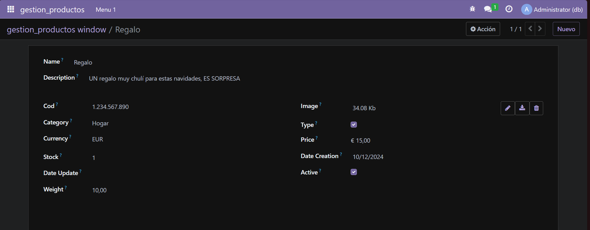
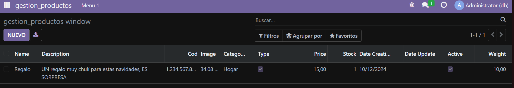

# Creación del primer modulo

## 1. Cracion de estuctura de modulo

Se abre un bash dentro del docker odoo y se ejecuta:
```bash
odoo scaffold gestion_productos /mnt/modulos-extra
```

## 2. Modificacion de manifest
Se abre el `manifest.py` y se modifica el fichero para que quede asi:

```python
# -*- coding: utf-8 -*-
{
    'name': "gestion_productos",

    'summary': """
        A comprehensive module for managing products, including inventory tracking,
        categorization, and sales management""",

    'description': """
        This module provides functionalities to manage products effectively within
        the Odoo platform. It includes features for inventory management, product
        categorization, and integration with sales processes, ensuring a seamless
        experience for users in handling their product-related tasks.
    """,

    'author': "My Company",
    'website': "https://www.yourcompany.com",

    'category': 'Inventory',
    'version': '0.1',

    'depends': ['base'],

    'data': [
        'security/ir.model.access.csv',
        'views/views.xml',
        'views/templates.xml',
    ],
    'demo': [
        'demo/demo.xml',
    ],
}
```
## 3. Definicion de modelo
Se abre el archivo `models.py` y se define el modelo de la siguiente manera:

```python
#-*- coding: utf-8 -*-

from odoo import models, fields, api #type: ignore


class gestion_productos(models.Model):
    _name = 'gestion_productos.gestion_productos'
    _description = 'gestion_productos.gestion_productos'

    name = fields.Char(required=True)
    description = fields.Text(required=True)
    cod = fields.Integer(required=True)
    image = fields.Image(required=True)
    
    category = fields.Selection([("jardin", "Jardin"), ("hogar", "Hogar"), ("electrodomésticos", "Electrodomésticos")])
    type = fields.Boolean()
    
    currency_id = fields.Many2one('res.currency', string='Currency')
    price = fields.Monetary(currency_field='currency_id')
    stock = fields.Integer()
    
    date_creation = fields.Date(default=fields.Date.context_today)
    date_update = fields.Date()
    
    active = fields.Boolean(default=True)
    weight = fields.Float(digits=(4, 2))
```


## 4. Definición de vistas y acciones
Aquí se solo descomente para que haya las menus basicos sin modificar nada y puse los `fields`  de `models.py`

```xml
<odoo>
  <data>
    <!-- explicit list view definition -->

    <record model="ir.ui.view" id="gestion_productos.list">
      <field name="name">gestion_productos list</field>
      <field name="model">gestion_productos.gestion_productos</field>
      <field name="arch" type="xml">
        <tree>
          <field name="name"/>
          <field name="description"/>
          <field name="cod" />
          <field name="image" />
          <field name="category" />
          <field name="type" />
          <field name="price" />
          <field name="stock" />
          <field name="date_creation" />
          <field name="date_update" />
          <field name="active" />
          <field name="weight" />
        </tree>
      </field>
    </record>


    <!-- actions opening views on models -->

    <record model="ir.actions.act_window" id="gestion_productos.action_window">
      <field name="name">gestion_productos window</field>
      <field name="res_model">gestion_productos.gestion_productos</field>
      <field name="view_mode">tree,form</field>
    </record>


    <!-- server action to the one above -->
<!--
    <record model="ir.actions.server" id="gestion_productos.action_server">
      <field name="name">gestion_productos server</field>
      <field name="model_id" ref="model_gestion_productos_gestion_productos"/>
      <field name="state">code</field>
      <field name="code">
        action = {
          "type": "ir.actions.act_window",
          "view_mode": "tree,form",
          "res_model": model._name,
        }
      </field>
    </record>
-->

    <!-- Top menu item -->

    <menuitem name="gestion_productos" id="gestion_productos.menu_root"/>

    <!-- menu categories -->

    <menuitem name="Menu 1" id="gestion_productos.menu_1" parent="gestion_productos.menu_root"/>

    <!-- actions -->

    <menuitem name="List" id="gestion_productos.menu_1_list" parent="gestion_productos.menu_1"
              action="gestion_productos.action_window"/>

  </data>
</odoo>
```
## 7. Instalación de modulos
Vamos a `aplicaciones` e instalamos nuestro modulo


## 6. Resultados


