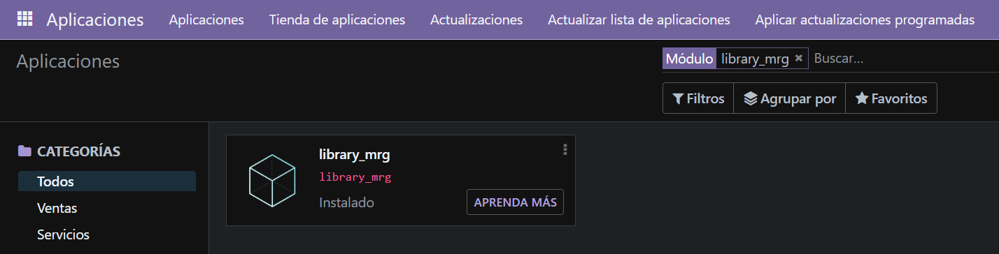
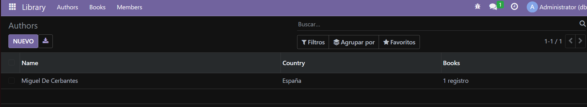
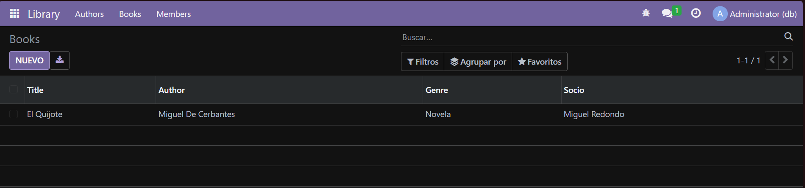
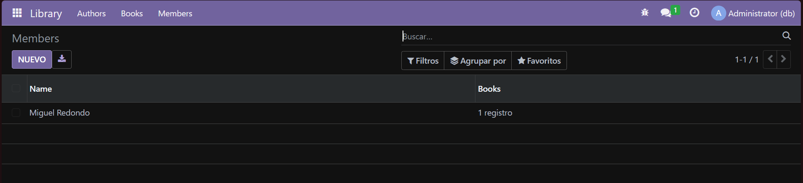

# Campos relacionales

## 1. Cracion de estuctura de modulo

Se abre un bash dentro del docker odoo y se ejecuta:
```bash
odoo scaffold library_mrg /mnt/extra-addons
```

## 2. Modificacion de manifest
Se abre el `manifest.py` y se modifica el fichero para que quede asi:

```python
# -*- coding: utf-8 -*-
{
    'name': "library_mrg",

    'summary': """
        A comprehensive module for managing library resources, including books, authors, and members.
    """,

    'description': """
        This module provides functionalities to manage library operations such as tracking books, managing authors, and handling member registrations. It aims to streamline library management processes and enhance user experience.
    """,

    'author': "Miguel",
    'website': "https://www.yourcompany.com",

    # Categories can be used to filter modules in modules listing
    # Check https://github.com/odoo/odoo/blob/16.0/odoo/addons/base/data/ir_module_category_data.xml
    # for the full list
    'category': 'Uncategorized',
    'version': '0.1',

    # any module necessary for this one to work correctly
    'depends': ['base'],

    # always loaded
    'data': [
        'security/ir.model.access.csv',
        'views/autores.xml',
        'views/socios.xml',
        'views/libros.xml',
        'views/menu.xml',
    ],
    # only loaded in demonstration mode
    'demo': [
        'demo/demo.xml',
    ],
}
```
## 3. Definicion de modelos
Se crea 3 modelos llamados `autores.py`, `libros.py` y `socios.py`:

**autores.py**
```python
# -*- coding: utf-8 -*-

from odoo import models, fields, api #type:ignore

class library_mrg_autor(models.Model):
    _name = 'library_mrg.autores'
    _description = 'library_mrg.autores'

    name = fields.Char(string='Name')
    pais = fields.Many2one('res.country', string='Country')
    libros_ids = fields.One2many('library_mrg.libros', 'author_id', string='Books')
```

**libros.py**
```python
# -*- coding: utf-8 -*-

from odoo import models, fields, api  # type:ignore

class library_mrg_libros(models.Model):
    _name = 'library_mrg.libros'
    _description = 'library_mrg.libros'

    title = fields.Char(string='Title')
    author_id = fields.Many2one('library_mrg.autores', string='Author')
    genre = fields.Selection([  # Changed 'gener' to 'genre'
        ('novela', 'Novela'),
        ('drama', 'Drama'),
        ('ciencia_ficcion', 'Ciencia Ficcion'),
        ('misterio', 'Misterio'),
        ('terror', 'Terror'),
        ('historico', 'Historico')
    ], string='Genre')
    socio_id = fields.Many2one('library_mrg.socios', string='Socio')
```

**socios.py**
```python
# -*- coding: utf-8 -*-

from odoo import models, fields, api  #type:ignore

class library_mrg_socios(models.Model):
    _name = 'library_mrg.socios'
    _description = 'library_mrg.socios'

    name = fields.Char(string='Name')
    libros_ids = fields.One2many('library_mrg.libros', 'socio_id', string='Books')
```

## 4. Modificacion de init.py (modelos)
Se modifica la impotacion de los modelos en el archivo `__init__.py`

```python
# -*- coding: utf-8 -*-

from . import socios
from . import libros
from . import autores
```


## 5. Definición de vistas y acciones
Aquí se crea solo la vista (`autores.xml`, `libros.xml` y `socios.xml`) de cada modelo (`autores.py`, `libros.py` y `socios.py`) y a mayores uno solo para el menu que se vinculara con las aciones de los xml (`menu.xml`)

**autores.xml**
```xml
<odoo>
  <data>
    <!-- explicit list view definition -->

    <record model="ir.ui.view" id="library_mrg.author_view">
      <field name="name">library_mrg list</field>
      <field name="model">library_mrg.autores</field>
      <field name="arch" type="xml">
        <tree>
          <field name="name"/>
          <field name="pais"/>
          <field name="libros_ids"/>
        </tree>
      </field>
    </record>

    <!-- actions opening views on models -->
    <record model="ir.actions.act_window" id="library_mrg.action_window_author">
      <field name="name">Authors</field>
      <field name="res_model">library_mrg.autores</field>
      <field name="view_mode">tree,form</field>
    </record>
  </data>
</odoo>
```

**libros.xml**
```xml
<odoo>
  <data>
    <!-- explicit list view definition -->
    <record model="ir.ui.view" id="library_mrg.libros_view">
      <field name="name">library_mrg list</field>
      <field name="model">library_mrg.libros</field>
      <field name="arch" type="xml">
        <tree>
          <field name="title"/>
          <field name="author_id"/>
          <field name="genre"/>
          <field name="socio_id"/>
        </tree>
      </field>
    </record>

    <!-- actions opening views on models -->

    <record model="ir.actions.act_window" id="library_mrg.action_window_book">
      <field name="name">Books</field>
      <field name="res_model">library_mrg.libros</field>
      <field name="view_mode">tree,form</field>
    </record>

  </data>
</odoo>
```

**socios.xml**
```xml
<odoo>
  <data>
    <!-- explicit list view definition -->
    <record model="ir.ui.view" id="library_mrg.socios_view">
      <field name="name">library_mrg list</field>
      <field name="model">library_mrg.socios</field>
      <field name="arch" type="xml">
        <tree>
          <field name="name"/>
          <field name="libros_ids"/>
        </tree>
      </field>
    </record>

    <!-- actions opening views on models -->
    <record model="ir.actions.act_window" id="library_mrg.action_window_members">
      <field name="name">Members</field>
      <field name="res_model">library_mrg.socios</field>
      <field name="view_mode">tree,form</field>
    </record>
  </data>
</odoo>
```

**menu.xml**
```xml
<odoo>
  <data>

    <!-- Top menu item -->
    <menuitem name="Library" id="library_mrg.menu_root"/>

    <!-- menu categories -->
    <menuitem name="Authors" id="library_mrg.author" parent="library_mrg.menu_root"/>
    <menuitem name="Books" id="library_mrg.book" parent="library_mrg.menu_root"/>
    <menuitem name="Members" id="library_mrg.members" parent="library_mrg.menu_root"/>

    <menuitem name="Manage Authors" id="library_mrg.menu_manage_authors" parent="library_mrg.author"
              action="library_mrg.action_window_author"/>
    <menuitem name="Manage Books" id="library_mrg.menu_manage_books" parent="library_mrg.book"
              action="library_mrg.action_window_book"/>
    <menuitem name="Manage Members" id="library_mrg.menu_manage_members" parent="library_mrg.members"
              action="library_mrg.action_window_members"/>

  </data>
</odoo>
```
## 7. Instalación de modulos
Vamos a `aplicaciones` e instalamos nuestro modulo



## 6. Resultados

**Menu**


**Autores**


**Libros**


**Socios**
