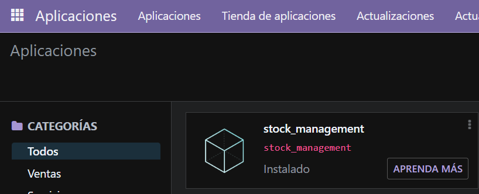
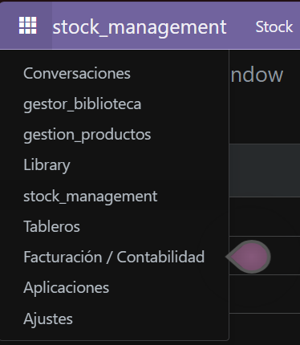
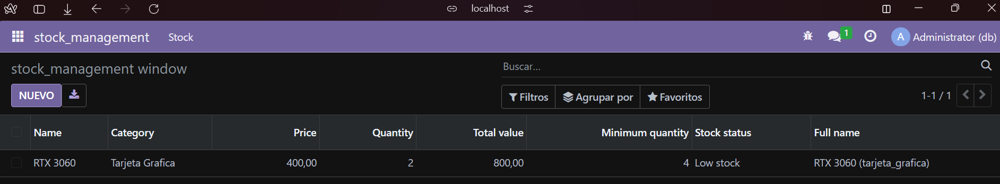

# Campos relacionales

## 1. Cracion de estuctura de modulo

Se abre un bash dentro del docker odoo y se ejecuta:
```bash
odoo scaffold stock_product /mnt/extra-addons
```

## 2. Modificacion de manifest
Se abre el `manifest.py` y se modifica el fichero para que quede asi:

```python
# -*- coding: utf-8 -*-
{
    'name': "Stock Management",

    'summary': """
        Manage stock levels, categories, and pricing for various products in an efficient manner.""",

    'description': """
        This module provides functionalities to manage stock items, including tracking their quantities, 
        prices, and categories. It allows users to monitor stock levels and receive alerts for low stock 
        situations, ensuring optimal inventory management.
    """,

    'author': "Miguel Redondo",
    'website': "https://www.yourcompany.com",

    'category': 'Inventory',
    'version': '0.1',

    # any module necessary for this one to work correctly
    'depends': ['base'],

    # always loaded
    'data': [
        'security/ir.model.access.csv',
        'views/views.xml',
        'views/templates.xml',
    ],
    # only loaded in demonstration mode
    'demo': [
        'demo/demo.xml',
    ],
}

```
## 3. Definicion de modelos
Se modifica el archivo de models se renombra a `stock_products.py` y se establecen los fields, campos computados y restricciones pedidas:

```python
# -*- coding: utf-8 -*-

from odoo import models, fields, api #type:ignore
from odoo.exceptions import ValidationError


class stock_product(models.Model):
    _name = 'stock_management.stock_product'
    _description = 'stock_management.stock_product'
    _sql_restricctions = [
        ('unique_name', 'unique(name)', 'EL nombre debe de ser unico'),
        ('check_quantity', 'CHECK(quantity>0)', 'La cantidad debe de ser mayor de 0')
    ]

    name = fields.Char(string='Name')
    category = fields.Selection([
        ('pc', 'PC'),
        ('microprocesador', 'Microprocesador'),
        ('tarjeta_grafica', 'Tarjeta Grafica'),
        ('ram', 'RAM')
    ], string='Category')
    price = fields.Float(string='Price')
    quantity = fields.Integer(string='Quantity')
    total_value = fields.Float(string='Total value', compute='_total_value', store=True)
    minimum_quantity = fields.Integer(string='Minimum quantity')
    stock_status = fields.Selection([
        ('normal', 'Normal'),
        ('low_stock', 'Low stock')
    ], string='Stock status', compute='_stock_status', store=True, )
    full_name = fields.Char(string='Full name', compute='_full_name', store=True)

    @api.depends('price', 'quantity')
    def _total_value(self):
        for record in self:
            record.total_value = record.price * record.quantity
            
    @api.depends('quantity', 'minimum_quantity')
    def _stock_status(self):
        for record in self:
            record.stock_status = 'normal' if record.quantity > record.minimum_quantity else 'low_stock'
            
    @api.depends('name', 'category')
    def _full_name(self):
        for record in self:
            record.full_name = f"{record.name} ({record.category})" if record.category else record.name
            
    @api.constrains('price')
    def _check_price(self):
        for record in self:
            if record.price < 0:
                raise ValidationError('El precio debe de ser mayor que 0')
            
    @api.constrains('quantity')
    def _check_quantity(self):
        for record in self:
            if record.quantity < 0:
                raise ValidationError('La cantidad debe de ser mayor que 0')
            
    @api.constrains('total_value')
    def _check_total_value(self):
        for record in self:
            if record.total_value > 100000:
                raise ValidationError('El valor total no debe de ser superior a 100000')
            
    @api.constrains('category')
    def _check_category(self):
        for record in self:
            if not record.category:
                raise ValidationError('Debe de estar en una categoria')
```

## 4. Modificacion de init.py (modelos)
Se modifica la impotacion de los modelos en el archivo `__init__.py`

```python
# -*- coding: utf-8 -*-

from . import stock_product
```


## 5. Definición de vistas y acciones
Aquí se modifica solo la vista para que se adecue a el modelo `stock_product.py`

**views**
```xml
<odoo>
  <data>
    <!-- explicit list view definition -->

    <record model="ir.ui.view" id="stock_management.list">
      <field name="name">stock_management list</field>
      <field name="model">stock_management.stock_product</field>
      <field name="arch" type="xml">
        <tree>
          <field name="name"/>
          <field name="category"/>
          <field name="price"/>
          <field name="quantity"/>
          <field name="total_value"/>
          <field name="minimum_quantity"/>
          <field name="stock_status"/>
          <field name="full_name"/>
        </tree>
      </field>
    </record>


    <!-- actions opening views on models -->

    <record model="ir.actions.act_window" id="stock_management.action_window">
      <field name="name">stock_management window</field>
      <field name="res_model">stock_management.stock_product</field>
      <field name="view_mode">tree,form</field>
    </record>

    <!-- Top menu item -->

    <menuitem name="stock_management" id="stock_management.menu_root"/>

    <!-- menu categories -->

    <menuitem name="Stock" id="stock_management.menu_1" parent="stock_management.menu_root"/>

    <!-- actions -->

    <menuitem name="Stock Management" id="stock_management.menu_1_list" parent="stock_management.menu_1"
              action="stock_management.action_window"/>

  </data>
</odoo>
```
## 6. Instalación de modulos
Vamos a `aplicaciones` e instalamos nuestro modulo



## 7. Resultados

**Menu**



**Result**


