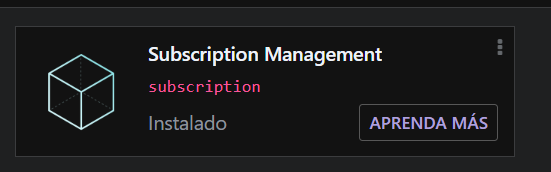
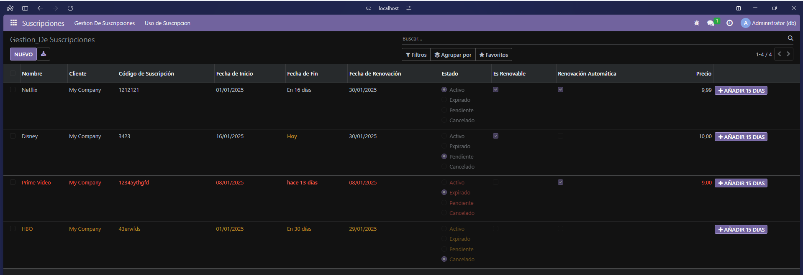
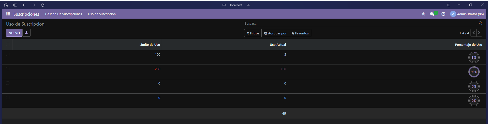

# Campos relacionales

## 1. Cracion de estuctura de modulo

Se abre un bash dentro del docker odoo y se ejecuta:
```bash
odoo scaffold subscription /mnt/extra-addons
```

## 2. Modificacion de manifest
Se abre el `manifest.py` y se modifica el fichero para que quede asi:

```python
# -*- coding: utf-8 -*-
{
    'name': "Subscription Management",

    'summary': """
        Manage subscriptions for various services and products""",

    'description': """
        This module provides functionalities to manage subscriptions, including creating, updating, and deleting subscription records. It allows users to track their subscriptions and manage related data efficiently.
    """,

    'author': "My Company",
    'website': "https://www.yourcompany.com",

    # Categories can be used to filter modules in modules listing
    # Check https://github.com/odoo/odoo/blob/16.0/odoo/addons/base/data/ir_module_category_data.xml
    # for the full list
    'category': 'Uncategorized',
    'version': '0.1',

    # any module necessary for this one to work correctly
    'depends': ['base'],

    # always loaded
    'data': [
        'security/ir.model.access.csv',
        'views/views.xml',
        'views/templates.xml',
    ],
    # only loaded in demonstration mode
    'demo': [
        'demo/demo.xml',
    ],
}
```
## 3. Definicion de modelos
Se modifica el archivo de models se renombra a `suscripcion.py` y se establecen los fields, campos computados y restricciones pedidas:

```python
# -*- coding: utf-8 -*-

from odoo import models, fields, api #type:ignore
from datetime import timedelta


class subscription(models.Model):
    _name = 'subscription.subscription'
    _description = 'subscription.subscription'
    _sql_restricctions = [
        ('unique_subscription_code', 'unique(subscription_code)', 'El codigo de suscripcion ya esta en uso')
    ]

    name = fields.Char(required=True, string="Nombre")
    customer_id = fields.Many2one(comodel_name='res.partner', required=True, string="Cliente")
    subscription_code = fields.Char(required=True, string="Código de Suscripción")
    start_date = fields.Date(required=True, string="Fecha de Inicio")
    end_date = fields.Date(required=True, string="Fecha de Fin")
    renewal_date = fields.Date(required=True, string="Fecha de Renovación")
    status = fields.Selection([('active', 'Activo'), ('expired', 'Expirado'), ('pending', 'Pendiente'), ('cancelled', 'Cancelado')], required=True, string="Estado")
    is_renewable = fields.Boolean(required=True, string="Es Renovable")
    auto_renewal = fields.Boolean(required=True, string="Renovación Automática")
    price = fields.Float(required=True, string="Precio")
    usage_limit = fields.Integer(string="Límite de Uso")
    current_usage = fields.Integer(string="Uso Actual")
    use_percent = fields.Float(compute='_compute_use_percent', store=True, string="Porcentaje de Uso")
            
    @api.depends('current_usage', 'usage_limit')
    def _compute_use_percent(self):
        for record in self:
            if record.usage_limit is 0 or record.current_usage is 0:
                record.use_percent = 0
            else:
                record.use_percent = (float(record.current_usage) * 100)/float(record.usage_limit)
                
    def add_days(self):
        for record in self:
            record.end_date = record.end_date + timedelta(days=15)
```

## 4. Modificacion de init.py (modelos)
Se modifica la impotacion de los modelos en el archivo `__init__.py`

```python
# -*- coding: utf-8 -*-

from . import suscription
```


## 5. Definición de vistas y acciones
Aquí se modifica solo la vista para que se adecue a el modelo `views.py`

**views**
```xml
<odoo>
  <data>
    <!-- explicit list view definition -->

    <record model="ir.ui.view" id="subscription_basic">
      <field name="name">Gestion De Suscripciones</field>
      <field name="model">subscription.subscription</field>
      <field name="arch" type="xml">
        <tree limit="15" decoration-danger="status=='expired'" decoration-warning="status=='cancelled'">
          <field name="name"/>
          <field name="customer_id"/>
          <field name="subscription_code"/>
          <field name="start_date"/>
          <field name="end_date" widget="remaining_days"/>
          <field name="renewal_date"/>
          <field name="status" widget="radio"/>
          <field name="is_renewable"/>
          <field name="auto_renewal"/>
          <field name="price" attrs="{'invisible': [('status', '==', 'cancelled')]}"/>
          <button name="add_days"
          type="object"
          string="Añadir 15 dias"
          class="btn-primary"
          icon="fa-plus"/>
        </tree>
      </field>
    </record>

    <record model="ir.ui.view" id="subscription_usage">
      <field name="name">Uso de Suscripcion</field>
      <field name="model">subscription.subscription</field>
      <field name="arch" type="xml">
        <tree decoration-danger="use_percent>=80" limit="15">
          <field name="usage_limit"/>
          <field name="current_usage" avg="1"/>
          <field name="use_percent" widget="percentpie"/>
        </tree>
      </field>
    </record>


    <!-- actions opening views on models -->

    <record model="ir.actions.act_window" id="subscription_basic_action_gestion">
      <field name="name">Gestion_De Suscripciones</field>
      <field name="res_model">subscription.subscription</field>
      <field name="view_mode">tree,form</field>
      <field name="view_id" ref="subscription_basic"/>
    </record>

    <record model="ir.actions.act_window" id="subscription_usage_action_use">
      <field name="name">Uso de Suscripcion</field>
      <field name="res_model">subscription.subscription</field>
      <field name="view_mode">tree,form</field>
      <field name="view_id" ref="subscription_usage"/>
    </record>

    <!-- Top menu item -->

    <menuitem name="Suscripciones" id="subscription.menu_root"/>

    <!-- menu categories -->

    <menuitem name="Gestion De Suscripciones" id="subscription.menu_1" parent="subscription.menu_root"/>
    <menuitem name="Uso de Suscripcion" id="subscription.menu_2" parent="subscription.menu_root"/>

    <!-- actions -->

    <menuitem name="Gestion De Suscripciones" id="subscription.menu_1_list" parent="subscription.menu_1"
              action="subscription_basic_action_gestion"/>
    <menuitem name="Uso de Suscripcion" id="subscription" parent="subscription.menu_2"
              action="subscription_usage_action_use"/>

  </data>
</odoo>
```
## 6. Instalación de modulos
Vamos a `aplicaciones` e instalamos nuestro modulo



## 7. Resultados

**Interfaz de Suscripcion**



**Interfaz de uso**


