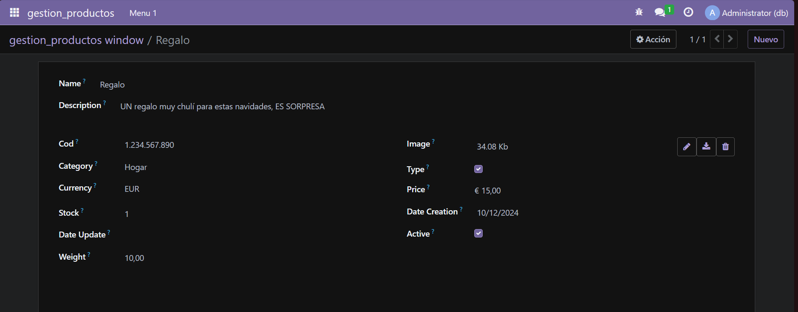
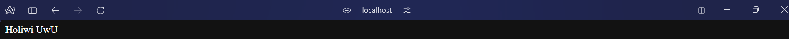
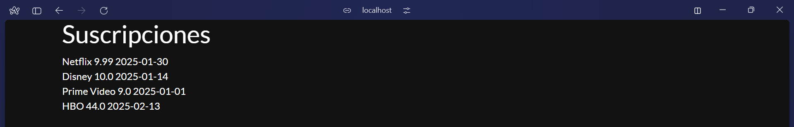

# Campos del modelo

## 1. Me basé en el módulo de [Suscripciones](../../ut06/pr0604/doc.md) del tema pasado

## 2. Definición de controlador
Aquí cree la web estatica con un return basico y la dinamica que le paso en un dicionario con las subscripciones

```python
# -*- coding: utf-8 -*-
from odoo import http

class Subscription(http.Controller):
    @http.route('/subscription/subscription/hello', auth='public')
    def index(self, **kw):
        return "Holiwi UwU"

    @http.route('/subscription/subscription/info', auth='public')
    def list(self, **kw):
        subs = http.request.env['subscription.subscription'].search([])
        return http.request.render('subscription.subscriptions_list', {
            'subs': subs
        })
```

## 3. Definición de vista
Aquí defini con la estrucctura adecuada para hacer en xml de odoo un html con el nombre, precio y fecha de finalizacion de cada suscripcion

```xml
<odoo>
    <template id="subscriptions_list" name="subscriptions_list">
        <t t-call="web.html_container">
            <div class="container">
                <h1>Suscripciones</h1>
                <t t-foreach="subs" t-as="sub">
                    <div>
                        <span><t t-esc="sub.name"/></span>
                        <span><t t-esc="sub.price"/></span>
                        <span><t t-esc="sub.end_date"/></span>
                    </div>
                </t>
            </div>
        </t>
    </template>
</odoo>
```

## 4. Manifest
  En el `manifest` añadi el xml creado
```python
# -*- coding: utf-8 -*-
{
    'name': "Subscription Management",

    'summary': """
        Manage subscriptions for various services and products""",

    'description': """
        This module provides functionalities to manage subscriptions, including creating, updating, and deleting subscription records. It allows users to track their subscriptions and manage related data efficiently.
    """,

    'author': "My Company",
    'website': "https://www.yourcompany.com",

    # Categories can be used to filter modules in modules listing
    # Check https://github.com/odoo/odoo/blob/16.0/odoo/addons/base/data/ir_module_category_data.xml
    # for the full list
    'category': 'Uncategorized',
    'version': '0.1',

    # any module necessary for this one to work correctly
    'depends': ['base'],

    # always loaded
    'data': [
        'security/ir.model.access.csv',
        'views/views.xml',
        'views/templates.xml',
        'views/subscriptions_list.xml'
    ],
    # only loaded in demonstration mode
    'demo': [
        'demo/demo.xml',
    ],
}
```

## 5. Instalación de modulos
Vamos a `aplicaciones` e instalamos nuestro modulo



## 6. Resultados
### Estatica


### Dinamica
