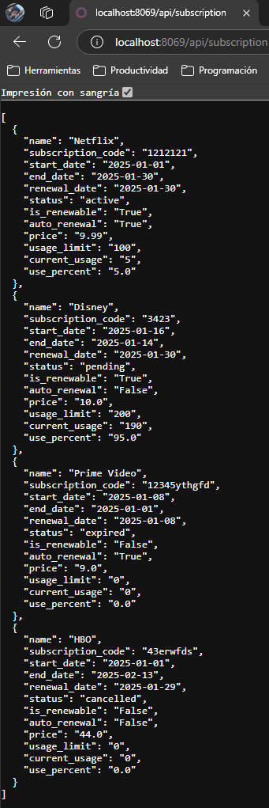
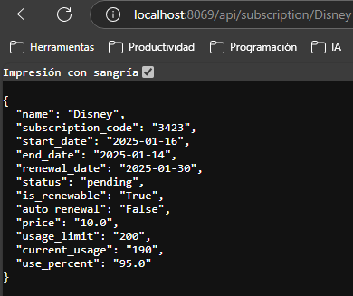

# API REST

## 1. Me basé en el módulo de [Suscripciones](../pr0701/doc.md) del ejercicio pasado

## 2. Añadir Request y Respond a un URL en `Controllers`
Añadi la parte del codigo con los url que empizan con /api/

```python
# -*- coding: utf-8 -*-
from odoo import http
import json

class Subscription(http.Controller):
    @http.route('/subscription/subscription/hello', auth='public')
    def index(self, **kw):
        return "Holiwi UwU"

    @http.route('/subscription/subscription/info', auth='public')
    def list(self, **kw):
        subs = http.request.env['subscription.subscription'].search([])
        return http.request.render('subscription.subscriptions_list', {
            'subs': subs
        })

    @http.route("/api/subscription", type="http", methods=['GET'], csrf=False)
    def get_subscriptions(self, **kw):
        subscriptions = http.request.env['subscription.subscription'].search([])
        result=[]
        for subscription in subscriptions:
            result.append({
                'name': str(subscription.name),
                'subscription_code': str(subscription.subscription_code),
                'start_date': str(subscription.start_date),
                'end_date': str(subscription.end_date),
                'renewal_date': str(subscription.renewal_date),
                'status': str(subscription.status),
                'is_renewable': str(subscription.is_renewable),
                'auto_renewal': str(subscription.auto_renewal),
                'price': str(subscription.price),
                'usage_limit': str(subscription.usage_limit),
                'current_usage': str(subscription.current_usage),
                'use_percent': str(subscription.use_percent),
            })
        response = http.Response(
            json.dumps(result),
            content_type = 'application/json',
            status = 200,
        )
        return response
        
    @http.route("/api/subscription/<string:name>", type="http", methods=['GET'], csrf=False)
    def get_subscriptions_name(self, name):
        try:
            subscription = http.request.env['subscription.subscription'].search([('name', '=', name)], limit=1)
            if not subscription:
                return http.Response(
                        json.dumps({'msg' : 'CPU no encontrada'}),
                        content_type = 'application/json',
                        status = 404,
                    )
            result = {
                'name': str(subscription.name),
                'subscription_code': str(subscription.subscription_code),
                'start_date': str(subscription.start_date),
                'end_date': str(subscription.end_date),
                'renewal_date': str(subscription.renewal_date),
                'status': str(subscription.status),
                'is_renewable': str(subscription.is_renewable),
                'auto_renewal': str(subscription.auto_renewal),
                'price': str(subscription.price),
                'usage_limit': str(subscription.usage_limit),
                'current_usage': str(subscription.current_usage),
                'use_percent': str(subscription.use_percent),
            }
            response = http.Response(
                json.dumps(result),
                content_type = 'application/json',
                status = 200,
            )
            return response
        except Exception as e:
            return http.Response(
                        json.dumps({'msg' : f'Error del servidor {str(e)}'}),
                        content_type = 'application/json',
                        status = 500,
                    )
```

## 5. Actualizacion del mofulo
Vamos a `aplicaciones` e instalamos nuestro modulo

## 6. Resultados
### Todos los productos


### Filtrando por nombre `Disney`
